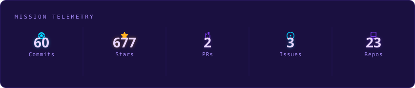

<!-- Galaxy Profile README — Auto-generated SVGs by github-actions -->
<!-- Run `python -m generator.main` locally or let the workflow handle it -->

<div align="center">
  
</div>

<br/>

<div align="center">
  <a href="https://git.io/typing-svg"></a>
</div>

<br/>

<!-- ========== ABOUT ME ========== -->

<div align="center">

### 🧑‍💻 About Me

```yaml
name: KimYx
identity: 游戏研发公司联合创始人 / AIGC 爱好者
career: 游戏策划 → 游戏主策 → 游戏制作人 → AI 探索者
experience: 15+ years in game industry
markets: 🇨🇳 🇻🇳 🇮🇩 🇲🇾 🇸🇬 🇵🇭
superpower: Vibe Coding
motto: 用产品思维驾驭 AI，用 AI 重新定义游戏
```

🎮 主营音舞游戏研发，创业 15 年老兵 &nbsp;·&nbsp;
🤖 因热爱 AI 而开启 AIGC 探索之旅 &nbsp;·&nbsp;
🎯 信奉「一个人 + AI = 一支完整团队」

🛠️ 一指禅 Vibe Coder，AI 就是我的双手 &nbsp;·&nbsp;
📚 维护开源 AIGC 知识库，乐于分享 &nbsp;·&nbsp;
🎵 做过的游戏让千万玩家跳起来

</div>

<br/>

<div align="center">
  
</div>

<br/>

<!-- ========== GAME PORTFOLIO ========== -->

<div align="center">

### 🎮 Game Portfolio

*研发上线过的产品，覆盖中国、东南亚多国市场*

<br/>


&nbsp;

&nbsp;

&nbsp;


<br/>


</div>

<br/>

<!-- ========== AIGC SKILLS ========== -->

<div align="center">

### 🤖 AIGC Skill Tree

*白天做游戏，晚上玩 AI —— 这就是热爱的力量*

<br/>

| 领域 | 熟练度 | 进度 | 常用工具 |
|:---:|:---:|:---|:---|
| 🎯 提示词工程 | ⭐⭐⭐⭐⭐ | 🟪🟪🟪🟪🟪🟪🟪🟪🟪🟪 `100%` | 各类 LLM Prompt 技巧 |
| 🤖 智能体搭建 | ⭐⭐⭐⭐ | 🟪🟪🟪🟪🟪🟪🟪🟪⬜⬜ `80%` | Coze · Dify · N8n |
| 💻 AI 编程 | ⭐⭐⭐⭐ | 🟪🟪🟪🟪🟪🟪🟪🟪⬜⬜ `80%` | Claude Code · Codex · Cursor |
| 🎨 AI 绘画 | ⭐⭐⭐ | 🟪🟪🟪🟪🟪🟪⬜⬜⬜⬜ `60%` | ComfyUI · Midjourney · SD |
| 🎵 AI 音乐 | ⭐⭐ | 🟪🟪🟪🟪⬜⬜⬜⬜⬜⬜ `40%` | Suno Studio |
| 🎬 AI 视频 | ⭐⭐ | 🟪🟪🟪🟪⬜⬜⬜⬜⬜⬜ `40%` | 即梦 · Wan2.2 · 可灵 · Pika |

</div>

<br/>

<div align="center">
  
</div>

<br/>

<!-- ========== AI TOOLBOX ========== -->

<div align="center">

### 🛠️ AI Toolbox

<br/>

**💻 AI 编程**


&nbsp;

&nbsp;

&nbsp;


<br/>

**🤖 智能体**


&nbsp;

&nbsp;


<br/>

**🎨 创作工具**


&nbsp;

&nbsp;


</div>

<br/>

<div align="center">
  
</div>

<br/>

<!-- ========== GITHUB ACTIVITY ========== -->

<div align="center">

### 📊 GitHub Activity

<br/>

<a href="https://github.com/KimYx0207">
  
</a>

<br/><br/>

<picture>
  <source media="(prefers-color-scheme: dark)" srcset="https://raw.githubusercontent.com/KimYx0207/KimYx0207/output/github-snake-dark.svg" />
  <source media="(prefers-color-scheme: light)" srcset="https://raw.githubusercontent.com/KimYx0207/KimYx0207/output/github-snake.svg" />
  
</picture>

</div>

<br/>

<!-- ========== PHILOSOPHY & CONNECT ========== -->

<div align="center">

### 💡 Philosophy

> *"我不是程序员，但我用 AI 让想法变成现实。"*
>
> *"产品思维 × AI 能力 = 无限可能。"*

<br/>

`🎮 Game Producer  ×  🤖 AI Explorer  =  🚀 Infinite Possibilities`

<br/>

---

**📫 Let's Connect**

如果你也在探索 AIGC 的无限可能，或者对音舞游戏感兴趣，欢迎交流！

<br/>

[](https://my.feishu.cn/wiki/OhQ8wqntFihcI1kWVDlcNdpznFf)
&nbsp;


<br/>

---

<sub>🔥 Powered by Vibe Coding &nbsp;|&nbsp; Galaxy Profile by <a href="https://github.com/vinimlo/galaxy-profile">galaxy-profile</a> &nbsp;|&nbsp; One Person + AI = One Team</sub>

<br/>

</div>
